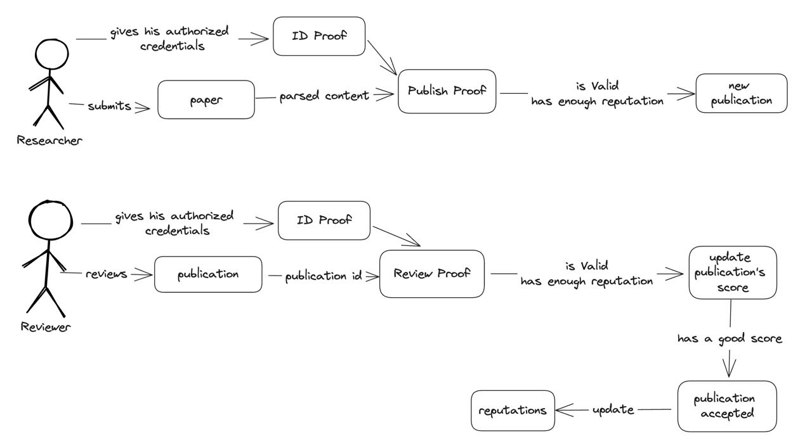

# ZKPeer


This repository implements a ZK-Based anonymous scientific journal publishing and reviewing De-Sci platform to combat the challenges faced by the scientific research community due to political interference, inconsistent funding, and the prioritization of short-term results over long-term, fundamental research. 

ZKPeer allows researchers to anonymously publish and review research papers while also taking measures to ensure that the publishers and the reviewers are qualified to to play their roles and the publications are legitimate. We achieve this my implementing a reputation-based AppChain on Mina Protocol built using protokit. 

## How it works

- The code consists of two main actors - a **researcher** and a **reviewer** (the same person can be both).
- At first, a ZK-circuit accepts a researcher's authorized credentials (such as a university email) privately which it validates and generates an **ID proof**. 
- When the researcher submits a paper, it is parsed and along with the ID proof as input, another circuit validates and generates a **publish proof** and a **publication ID**. 
- When the published paper has a high enough score (in this case, positive reviews from qualified reviewers), it is published on-chain. 



- A reviewer also has a generated **ID proof**
- They review the paper and vote yes or no for its publication on-chain. This vote, along with the publication ID and the ID proof is validated in a ZK circuit to generate a **review proof**
- The number of positive and negative reviews keep updating the publication's score. If the score meets a certain threshold within a time limit, it is published or else it is discarded. 
- The final step **updates the reputations** of the researchers that is based on their **publication scores**, **number of valid reviews** and **number of times their publications are cited** by other researchers.

## Quick start

<!-- The monorepo contains 1 package and 1 app:

- `packages/chain` contains everything related to your app-chain
- `apps/web` contains a demo UI that connects to your locally hosted app-chain sequencer -->

**Prerequisites:**

- Node.js v18
- pnpm
- nvm

<!-- > If you're on windows, please use Docker until we find a more suitable solution to running the `@proto-kit/cli`. 
> Run the following command and then proceed to "Running the sequencer & UI":
>
> `docker run -it --rm -p 3000:3000 -p 8080:8080 -v %cd%:/starter-kit -w /starter-kit gplane/pnpm:node18 bash` -->


### Setup

```zsh
git clone https://github.com/rutefig/zkpeer.git
cd zkpeer

# ensures you have the right node.js version
nvm use
pnpm install
```

<!-- ### Running the sequencer & UI

```zsh
# starts both UI and sequencer locally
pnpm dev

# starts UI only
pnpm dev -- --filter web
# starts sequencer only
pnpm dev -- --filter chain
``` -->

### Running tests
```zsh
# run and watch tests for the `chain` package
pnpm run test --filter=chain -- --watchAll
```

<!-- Navigate to `localhost:3000` to see the example UI, or to `localhost:8080/graphql` to see the GQL interface of the locally running sequencer. -->
